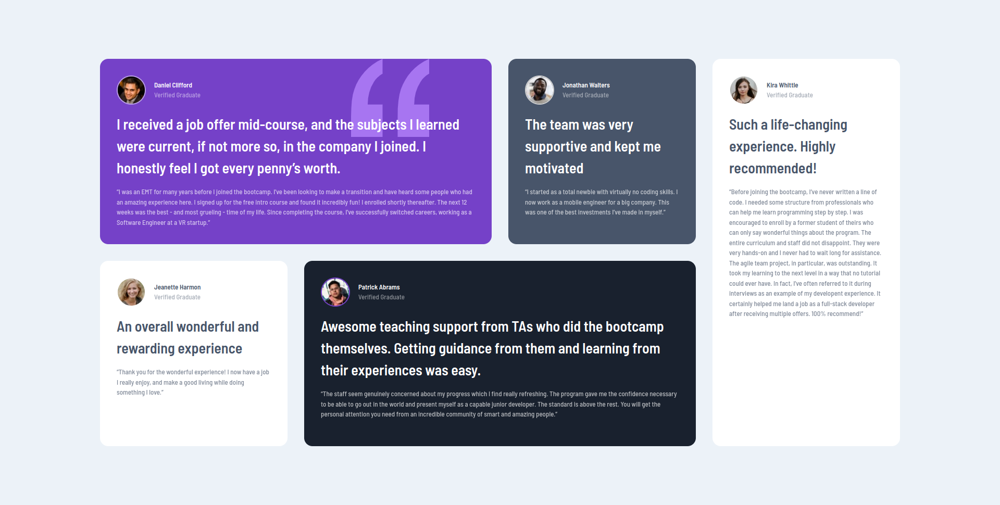

# Frontend Mentor - Testimonials grid section solution

This is a solution to the [Testimonials grid section challenge on Frontend Mentor](https://www.frontendmentor.io/challenges/testimonials-grid-section-Nnw6J7Un7). Frontend Mentor challenges help you improve your coding skills by building realistic projects.

## Table of contents

-   [Overview](#overview)
    -   [The challenge](#the-challenge)
    -   [Screenshot](#screenshot)
    -   [Links](#links)
-   [My process](#my-process)
    -   [Built with](#built-with)
    -   [What I learned](#what-i-learned)
    -   [Continued development](#continued-development)
    -   [Useful resources](#useful-resources)
-   [Author](#author)

## Overview

### The challenge

Users should be able to:

-   View the optimal layout for the site depending on their device's screen size

### Screenshot



### Links

-   Solution URL: [https://github.com/alvaro-jrr/testimonials-grid-section](https://github.com/alvaro-jrr/testimonials-grid-section)
-   Live Site URL: [http://testimonials-grid-section-sigma.vercel.app/](http://testimonials-grid-section-sigma.vercel.app/)

## My process

### Built with

-   Semantic HTML5 markup
-   CSS custom properties
-   Flexbox
-   CSS Grid
-   Mobile-first workflow

### What I learned

I'm proud of this CSS, because its that made me correctly set the quotation in the background:

```css
.main-card {
	background: url("./images/bg-pattern-quotation.svg") top right / 150px 150px
		no-repeat local var(--moderate-violet);
	background-position-x: 80%;
}
```

In other hand, I'm really impressed that I could actually make the layout work. These CSS codes below are the ones that let me do it:

```css
/*
    Mobile
*/
.grid {
	display: flex;
	flex-flow: column nowrap;
	row-gap: 2rem;
	max-width: 65ch;
}

/*
    Desktop
*/
@media (min-width: 1440px) {
	.grid {
		display: grid;
		grid-template-columns: repeat(4, 1fr);
		grid-template-rows: repeat(2, 1fr);
		max-width: 80vw;
		gap: 2rem;
	}

	.grid-column-1-3 {
		grid-column: 1 / 3;
	}

	.grid-column-2-4 {
		grid-column: 2 / 4;
	}

	.grid-column-1 {
		grid-column: 1;
	}

	.grid-column-3 {
		grid-column: 3;
	}

	.grid-column-4 {
		grid-column: 4;
	}

	.grid-row-full {
		grid-row: 1 / -1;
	}
}
```

### Continued development

I want to keep improving on CSS Grid, because there's so many things it can be done with it! It let us create complex layout in a simple way.

### Useful resources

-   [Josh's Custom CSS Reset ](https://www.joshwcomeau.com/css/custom-css-reset/) - This helped me reset my CSS and gave me more knowledge due the way it works.
-   [CSS Tricks - Background Attachment](https://css-tricks.com/almanac/properties/b/background-attachment/) - This article helped me set correctly the quotation icon.

## Author

-   Website - [Add your name here](https://www.your-site.com)
-   Frontend Mentor - [@yourusername](https://www.frontendmentor.io/profile/yourusername)
